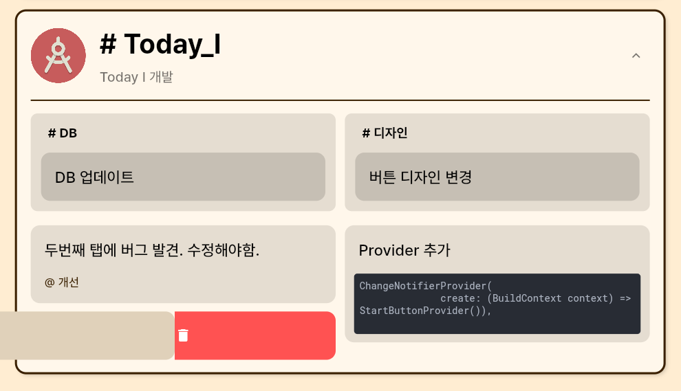

# TODAY I
**Today I는 자신의 하루를 기록할 수 있는 공간 입니다.**   
Link : [TODAY I](today-i-b7873.web.app/#/)  

## Motivation
이 프로젝트는 개발 공부를 하는 과정에서 제가 느낀 불편함을 개선하기 위해 시작하였습니다.   
수 많은 기록, 노트 프로그램들이 있고 많은 사람들이 그 프로그램들을 사용하여 여러 정보들을 기록하고 저장합니다. 그냥 혼자만의 기록을 남겨 두기 위해 로컬 또는 개인 드라이브에 작성하는 사람이 있는가 하면, 누구나 볼 수 있는 여러 블로그 사이트에 기록을 남겨 두는 사람도 있습니다. 저 역시 프로젝트를 진행하고 개발 공부를 하면서 그날그날 개발한 것, 배운 것을 기록함의 중요성을 느꼈습니다. 흔히 TIL (Today I Learn)이라고 부르는 하루의 기록을 작성하기 위해 여러 프로그램과 사이트를 사용해보았습니다. 그 결과 저는 각각의 부족한 점을 찾았습니다.

 - TIL이라 함은 하루에 배웠던 점을 간략하게 써야하는데 온라인 블로그 플랫폼에서 글을 작성하다 보면 독자를 의식하며 작성하는데 불필요하게 많은 노력을 쏟게 된다. 따라서 꾸준하게 작성하기 점점 힘들어진다.
 -  이전에 작성했던 TIL을 보기 힘들다. 하루에 여러가지 task를 진행했을 때 추후에 그 부분만 골라 보기 힘들다.
 -  템플릿의 부재. 간략하게 코드와 배운점 등을 정리하기 위한 알맞은 템플릿이 딱히 없다. 

그래서 저는 제가 직접 사용하고 싶은 **개발자 중심적인** TIL 작성 플랫폼을 만들기로 하였습니다. 

## 사용법
회원 가입과 로그인을 하면 메인 페이지에 접속 할 수 있습니다.  

### 태그
1.  태그는 'Today I'에서 기록을 작성할 수 있는 공간입니다. 각 태그는 하나의 주제를 의미합니다. 
2. '태그 생성'을 통해 기록할 새로운 주제를 생성 할 수 있고 기존에 생성한 태그에 대해 기록을 작성하려면 '태그 추가'를 선택합니다.  
    
4. 중앙에 생성된 태그를 길게 클릭하면 태그에 대한 정보를 수정할 수 있습니다.  
5. 상단의 달력을 클릭하면 다른 날짜에 대한 기록들을 조회, 수정할 수 있습니다.   
	 
### 노트에디터   
1. 여러 개의 태그가 존재할 때 기록을 작성하고자 하는 태그를 클릭하면 굵은 선으로 표시가 됩니다.  
2.  노트 에디터에서는 기본적인 텍스트 기록 뿐만 아니라 각각의 기록에 추가적으로 코드,링크, 느낀점, 서브태그를 추가할 수 있습니다. 각각은 동시에 추가할 수 있습니다.  
3. '느낀점'은 작성할 기록에 대해 느꼈던 감정을 추가할 수 있습니다.     
4. '서브태그'는 하나의 태그 안에서도 나뉠수 있는 여러 분야를 따로 관리하기 위해 사용할 수 있습니다. 예를 들어 어떤 프로그램을 제작할 때 디자인, 프론트엔드, 백엔드를 나누어 제작할 때 이것을 서브 태그를 활용하여 기록할 수 있습니다.     
5. 기록을 삭제하기 위해서는 태그안에 존재하는 기록을 옆으로 스와이프 하면 됩니다.     
     

## 추가예정 

 - 이전의 기록들을 태그, 서브태그, 느낀점 별로 각각 조회 할 수 있는 검색 시스템
 -  마크다운 형식으로 내보낼 수 있는 Export 시스템
 -  여러 사람들과 기록을 공유할 수 있고 상호작용할 수 있는 소셜 피드
